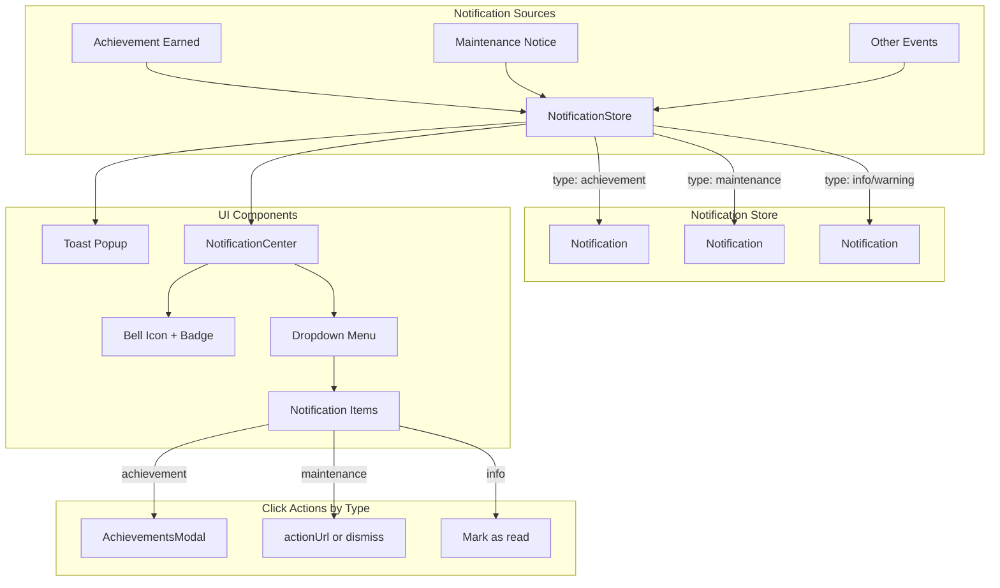

# Achievement Toast Notifications

## Current State Analysis

- **Toast infrastructure**: Sonner component exists at `src/components/ui/sonner.tsx` but uses `next-themes` which isn't configured
- **Achievement flow**: `finalizeSession` and `saveResult` return `newAchievements: string[]` but the client ignores it
- **Modal scrolling**: `AchievementsModal` accepts `initialCategory` but not a specific achievement ID
- **Header layout**: Right side has Leaderboard button, Stats button (signed in), then `UserButton`

## Architecture




## Implementation

### 1. Fix Sonner Component

Modify [src/components/ui/sonner.tsx](src/components/ui/sonner.tsx) to remove `next-themes` dependency and accept theme colors as props or use inline styles that match the typing theme.

### 2. Add Toaster to App

Add `<Toaster position="top-center" />` to [src/main.tsx](src/main.tsx) outside the routes but inside providers.

### 3. Create Notification Store

Create `src/lib/notification-store.ts` using a simple React context or Zustand-like pattern:

**Notification structure (generic and extensible):**

```typescript
type NotificationType = "achievement" | "maintenance" | "info" | "warning" | "error";

interface Notification {
  id: string;
  type: NotificationType;
  title: string;
  description: string;
  timestamp: number;
  read: boolean;
  // Type-specific metadata (extensible for future types)
  metadata?: {
    achievementId?: string;  // For achievement notifications
    actionUrl?: string;      // For notifications with custom links
    severity?: string;       // For maintenance/warning notifications
    [key: string]: unknown;  // Future extensibility
  };
}
```

**Methods:**

- `addNotification(notification)` - Add new notification
- `markAsRead(id)` - Mark single notification as read
- `markAllAsRead()` - Mark all as read
- `clearAll()` - Remove all notifications
- `getUnreadCount()` - For badge display

**Persistence:** Store in localStorage for session continuity

### 4. Create NotificationCenter Component

Create `src/components/layout/NotificationCenter.tsx`:

- Bell icon button (matches existing header button style: `h-10 w-10 rounded-lg`)
- Badge showing unread count (hidden when 0)
- Dropdown menu listing recent notifications
- Each item shows:
  - Icon based on `type` (trophy for achievement, wrench for maintenance, info icon, etc.)
  - Title and description
  - Relative timestamp ("2m ago", "1h ago")
- Click behavior depends on `type`:
  - `achievement`: Opens AchievementsModal scrolled to that achievement
  - `maintenance`/`info`: Just marks as read (or navigates to `metadata.actionUrl` if present)
- "Mark all as read" and "Clear all" options at bottom

### 5. Update Header

Modify [src/components/layout/Header.tsx](src/components/layout/Header.tsx):

- Import and render `NotificationCenter` between Stats button and `UserButton`
- Pass theme prop for consistent styling

### 6. Update TypingPractice to Show Toasts

Modify [src/components/typing/TypingPractice.tsx](src/components/typing/TypingPractice.tsx) in `saveResults`:

- Extract `newAchievements` from `finalizeResult` and legacy `saveResultMutation`
- For each achievement, call `toast()` with:
  - Title: Achievement title
  - Description: Achievement description  
  - Action button: "View" that opens modal
- Add notifications to the store

### 7. Enhance AchievementsModal

Modify [src/components/auth/AchievementsModal.tsx](src/components/auth/AchievementsModal.tsx):

- Add `initialAchievementId?: string` prop
- On mount with `initialAchievementId`:
  - Find achievement's category
  - Scroll to category section
  - Then scroll/highlight the specific achievement card
- Add ref to each achievement card for precise scrolling

### 8. Theme Integration

Style all new components using the `theme` prop passed from parent:

- Toast background: `theme.surfaceColor`
- Toast text: `theme.correctText`
- Toast border/accent: Based on notification type
  - `achievement`: Achievement tier colors (copper/silver/gold/diamond/emerald)
  - `maintenance`: Orange/amber accent
  - `warning`: Yellow accent
  - `error`: Red accent
  - `info`: Blue accent
- Bell icon: `theme.buttonUnselected`
- Dropdown: Match existing `UserButton` dropdown styling

## Files to Create/Modify

**Create:**

- `src/lib/notification-store.ts` - Generic notification state management with type support
- `src/components/layout/NotificationCenter.tsx` - Bell icon with dropdown

**Modify:**

- `src/components/ui/sonner.tsx` - Remove next-themes, accept theme
- `src/main.tsx` - Add Toaster component
- `src/components/layout/Header.tsx` - Add NotificationCenter
- `src/components/typing/TypingPractice.tsx` - Extract newAchievements, show toasts
- `src/components/auth/AchievementsModal.tsx` - Add initialAchievementId support

