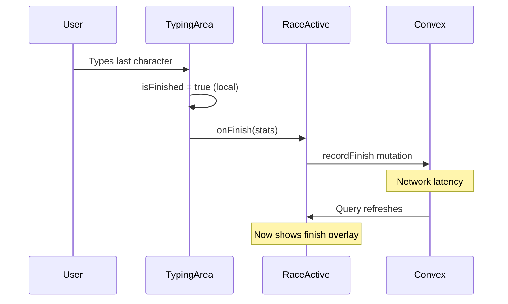
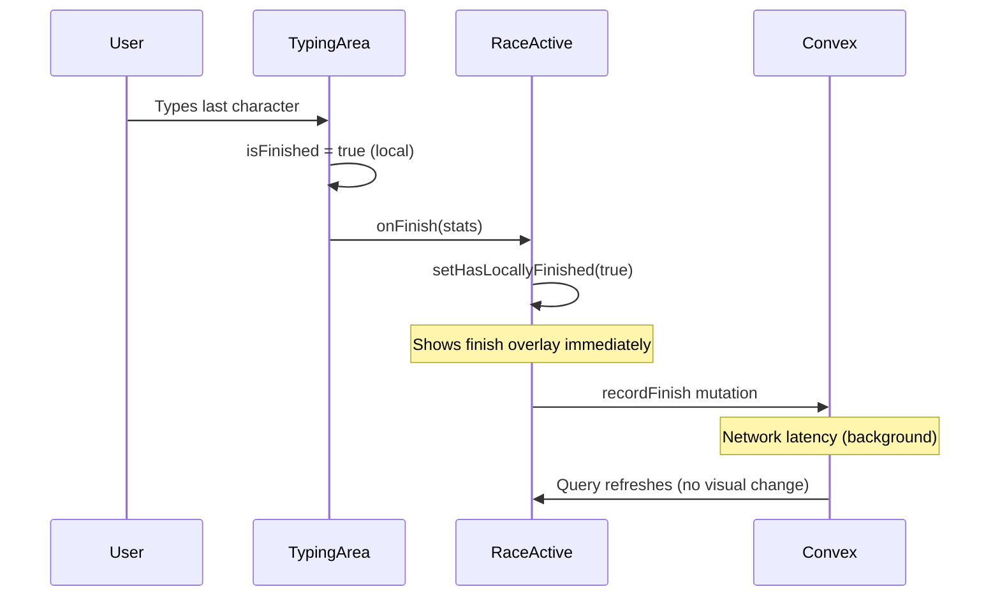

# Race Finish Detection Fix

## Problem Analysis

When a user finishes typing all words correctly in race mode, there's a delay before their race is marked as finished. The current flow has these delays:

1. User types last character correctly
2. `TypingArea` detects `isFinished` locally (immediate)
3. `onFinish` callback fires, calling `recordFinish` mutation (immediate)
4. **Network delay**: Convex mutation completes (variable latency)
5. **Subscription delay**: Convex query refreshes (variable latency)
6. `currentParticipant?.stats?.isFinished` becomes true
7. Finish overlay shows and typing is disabled

The UI waits for steps 4-6 before showing the finish state, causing the perceived delay tied to the progress bar animation catching up.

## Current Flow

## Solution

Add local state in `RaceActive` to track when the current user has finished, showing the finish overlay immediately without waiting for Convex round-trip.

### Changes to [src/pages/RaceActive.tsx](src/pages/RaceActive.tsx)

1. Add local state to track immediate finish:
  - Add `const [hasLocallyFinished, setHasLocallyFinished] = useState(false);`
2. Update `handleFinish` to set local state immediately:
  - Call `setHasLocallyFinished(true)` at the start of `handleFinish`, before the async mutation
3. Update `isTypingDisabled` to include local finish state:
  - Change from: `!raceStarted || isRaceEnded || currentParticipant?.stats?.isFinished`
  - Change to: `!raceStarted || isRaceEnded || hasLocallyFinished || currentParticipant?.stats?.isFinished`
4. Update finish overlay condition:
  - Change from: `currentParticipant?.stats?.isFinished && !isRaceEnded`
  - Change to: `(hasLocallyFinished || currentParticipant?.stats?.isFinished) && !isRaceEnded`
5. Reset `hasLocallyFinished` when room changes (for race restart scenarios):
  - Add to the existing room change detection or create a new effect

## Result

The user will see the "You Finished!" overlay immediately when they type the last character correctly, providing instant feedback regardless of network conditions.