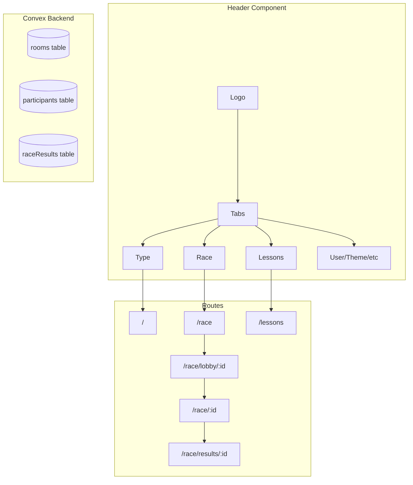
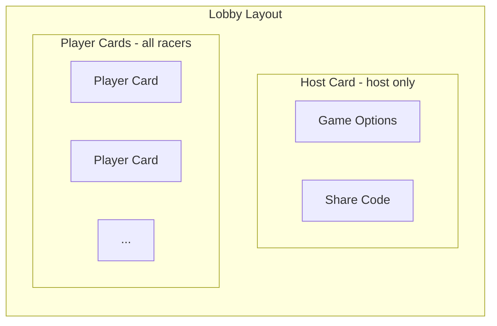

# Tabs Navigation and Racing Feature

## Design Decisions

Based on clarifications:

- **Player limit:** Unlimited racers per race (scrolling list in lobby, scrolling lanes on track)
- **Visual style:** Lane-based horizontal track like a running race
- **Disconnect handling:** Racers can rejoin if they reconnect quickly (progress stored server-side)
- **Connect infrastructure:** "Connect" is the unified infrastructure name; Race is the first implementation using it
- **Platform priority:** Desktop first; mobile support is a future enhancement
- **Avatar emojis:** Curated list of ~20-30 racing/character emojis for anonymous users
- **Countdown display:** Inline in lobby - numbers replace the Ready button area when all are ready
- **Race end behavior:** Typing freezes instantly when race ends (no finish-current-word grace period)

### Theming Guidelines

All new UI elements MUST respect the user's selected theme. Use `useTheme()` hook and apply colors from the `LegacyTheme` object:


| Element Type               | Theme Property                                |
| -------------------------- | --------------------------------------------- |
| Page backgrounds           | `theme.backgroundColor`                       |
| Cards/surfaces             | `theme.surfaceColor`                          |
| Elevated elements          | `theme.elevatedColor`                         |
| Active/selected states     | `theme.buttonSelected`                        |
| Inactive/unselected states | `theme.buttonUnselected`                      |
| Primary text               | `theme.textPrimary`                           |
| Secondary text             | `theme.textSecondary`                         |
| Muted text                 | `theme.textMuted`                             |
| Accent highlights          | `theme.accentColor`                           |
| Success states             | `theme.statusSuccess`                         |
| Error states               | `theme.statusError`                           |
| Borders                    | `theme.borderDefault` or `theme.borderSubtle` |


**Never use hardcoded colors** - always reference theme properties via inline `style` attributes.

---

## Architecture Overview




---

## Phase 1: Tab Navigation in Header

Add a tab selector between the logo and right-side elements in [Header.tsx](src/components/layout/Header.tsx).

**Implementation:**

- Use Shadcn `Tabs` component with custom styling to match the header aesthetic
- Tabs: "Type" (default, `/`), "Race" (`/race`), "Lessons" (`/lessons`)
- Use `useLocation` from react-router to highlight active tab
- Hide tabs when typing is active (same as other header elements)

**Key code location:** `src/components/layout/Header.tsx` (lines 35-110)

---

## Phase 2: Unified Connect Infrastructure

Extend the existing `rooms` and `participants` tables to support different game modes.

### Schema Changes ([convex/schema.ts](convex/schema.ts))

**Rooms table additions:**

- `gameMode: v.union(v.literal("practice"), v.literal("race"), v.literal("lesson"))` - distinguishes room type
- `readyParticipants: v.array(v.string())` - list of sessionIds that are ready
- `raceStartTime: v.optional(v.number())` - timestamp when race actually starts
- `targetText: v.string()` - shared text all racers type (for fairness)

**Participants table additions:**

- `isReady: v.boolean()` - ready status for countdown
- `emoji: v.optional(v.string())` - chosen emoji avatar
- `finishTime: v.optional(v.number())` - when they finished (for ranking)
- `position: v.optional(v.number())` - their race position (1st, 2nd, etc.)
- `disconnectedAt: v.optional(v.number())` - timestamp when disconnected (for rejoin window)
- `typedProgress: v.number()` - characters correctly typed (for rejoin restore)

**New table - `raceResults`:**

- `raceId: v.id("rooms")` - reference to the race room
- `rankings: v.array(...)` - final positions with stats
- `createdAt: v.number()`

### New/Updated Convex Functions

**In [convex/rooms.ts](convex/rooms.ts):**

- Update `create` to accept `gameMode` parameter
- Add `generateRaceText` - generates shared text based on difficulty/word count
- Add `startRace` - initiates countdown, sets `raceStartTime`

**In [convex/participants.ts](convex/participants.ts):**

- Add `setReady` / `setNotReady` mutations
- Add `setEmoji` mutation
- Update `updateStats` to track `finishTime` and `position`

**New file [convex/raceResults.ts](convex/raceResults.ts):**

- `saveResults` - stores final race results
- `getResults` - query results by raceId

---

## Phase 3: Reusable Typing Component

Extract the core typing input/display from [TypingPractice.tsx](src/components/typing/TypingPractice.tsx) into a focused, reusable component.

**New component: `src/components/typing/TypingArea.tsx**`

```typescript
interface TypingAreaProps {
  targetText: string;           // Text to type
  onProgress: (stats: TypingStats) => void;  // Stats callback
  isActive: boolean;            // Enable/disable input
  mode?: "standard" | "race";   // Display mode
  showStats?: boolean;          // Show inline WPM/accuracy
  feedingTape?: boolean;        // Race mode: words scroll left-to-right
}
```

**What it handles:**

- Character-by-character typing logic
- Error highlighting
- WPM/accuracy calculation
- Focus management
- Optional feeding tape mode for races

**What stays in TypingPractice:**

- Settings management
- Mode selection (time/words/quote/zen)
- Word generation
- LocalStorage persistence
- Results display

---

## Phase 4: Race Feature Implementation

### 4.1 Race Landing Page (`/race`)

**File: `src/pages/Race.tsx**`

Layout: Two cards side by side (similar to existing Connect page)

- **Host Card:** Button to create race (requires sign-in), redirects to `/race/lobby/:id?host=true`
- **Join Card:** Code input + name input (optional if signed in), redirects to `/race/lobby/:id`

### 4.2 Race Lobby (`/race/lobby/:lobbyId`)

**File: `src/pages/RaceLobby.tsx**`




**Host Card (visible only to host):**

- Difficulty selector (beginner/easy/medium/hard/expert)
- Word count selector
- Display room code for sharing

**Player Card (one per participant):**

- Profile picture (from account) or emoji picker (curated list)
- Username (editable if not signed in)
- "Ready" button (toggleable)
- Visual indicator of ready state (checkmark, glow, or similar)
- Cards displayed in scrollable grid (unlimited players supported)

**Countdown Logic:**

- When all participants have `isReady: true`, start 5-second countdown
- Countdown displays inline, replacing the Ready button area (big numbers: 5, 4, 3, 2, 1)
- If anyone un-readies, cancel countdown immediately
- When countdown ends, redirect all to `/race/:raceId`

### 4.3 Racing Screen (`/race/:raceId`)

**File: `src/pages/RaceActive.tsx**`

Layout: Split screen

- **Top 2/3:** Race course visualization
- **Bottom 1/3:** Typing area (using reusable `TypingArea` component)

**Race Course Component: `src/components/race/RaceCourse.tsx**`

- Lane-based horizontal track (like a running race)
- Start line on left, finish line on right
- Each racer gets their own lane with emoji/avatar
- Position based on progress % (correct chars / total chars)
- Scrollable vertically if many racers (unlimited players)
- Real-time updates via Convex subscription
- Visual indicators: current position labels (1st, 2nd, 3rd...)

**Race Logic:**

- All racers type the same `targetText` (generated by host settings)
- Progress = (correct characters typed / total characters) * 100
- Position updates as racers progress
- When top 3 finish, remaining racers get 10-second timer
- Race ends when timer expires or everyone finishes
- **Freeze behavior:** Typing input disables instantly when race ends (no grace period)
- **Reconnection:** If racer disconnects, they have ~30 seconds to rejoin and resume from `typedProgress`

### 4.4 Results Screen (`/race/results/:raceId`)

**File: `src/pages/RaceResults.tsx**`

Layout:

- Podium display (1st, 2nd, 3rd) similar to leaderboard
- List of all other participants below
- Stats for each: WPM, accuracy, time
- Two buttons: "Ready Again" (return to lobby) or "Leave" (return to `/race`)

---

## Phase 5: Routes and Navigation

**Updates to [App.tsx](src/App.tsx):**

```typescript
// New routes
<Route path="/race" element={<Race />} />
<Route path="/race/lobby/:lobbyId" element={<RaceLobby />} />
<Route path="/race/:raceId" element={<RaceActive />} />
<Route path="/race/results/:raceId" element={<RaceResults />} />
<Route path="/lessons" element={<Lessons />} />  // placeholder
```

---

## File Structure Summary

**New files to create:**

- `src/pages/Race.tsx` - landing page
- `src/pages/RaceLobby.tsx` - lobby with ready system
- `src/pages/RaceActive.tsx` - racing screen
- `src/pages/RaceResults.tsx` - results with podium
- `src/pages/Lessons.tsx` - placeholder
- `src/components/typing/TypingArea.tsx` - reusable typing component
- `src/components/race/RaceCourse.tsx` - lane-based track visualization
- `src/components/race/PlayerCard.tsx` - player display in lobby
- `src/components/race/EmojiPicker.tsx` - emoji selection from curated list
- `src/components/race/Podium.tsx` - results podium
- `src/lib/race-emojis.ts` - curated list of ~20-30 racing/character emojis
- `convex/raceResults.ts` - race results functions

**Files to modify:**

- `src/components/layout/Header.tsx` - add tabs
- `src/App.tsx` - add routes
- `convex/schema.ts` - extend rooms/participants, add raceResults
- `convex/rooms.ts` - add race-specific functions
- `convex/participants.ts` - add ready/emoji functions

---

## Implementation Order

Recommended sequence for incremental, testable progress:

1. **Header tabs** - visible navigation change, low risk
2. **Schema updates** - backend foundation
3. **Race landing page** - simple entry point
4. **Lobby page** - host/join flow, player cards, ready system
5. **TypingArea extraction** - refactor before racing screen
6. **Racing screen** - core race experience
7. **Results screen** - finish the flow
8. **Polish** - animations, edge cases, error handling

