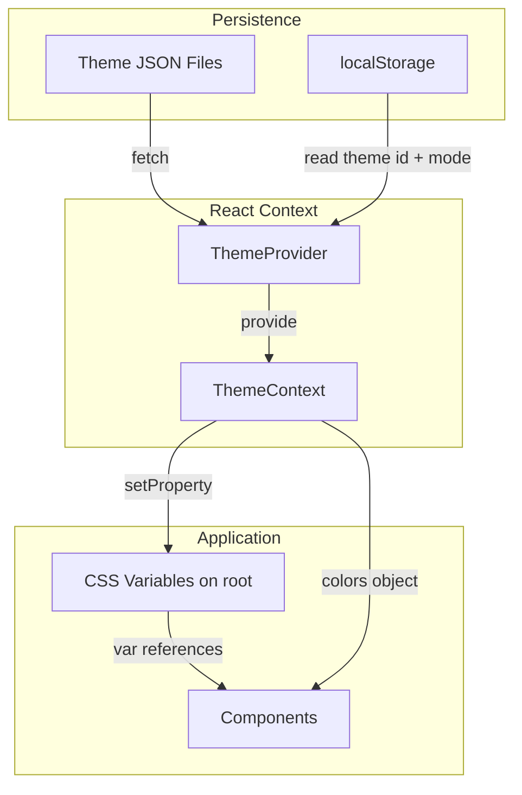

# Theme System Redesign

## Current State

The existing theme system uses 10 flat properties applied via inline styles (163+ occurrences in TypingPractice alone). CSS variables exist but are unused, and there's no support for light/dark mode, opacity variants, borders, shadows, or focus states.

## Proposed Architecture

### New Theme Structure

```typescript
// src/types/theme.ts
// All variants specified manually in JSON for full control
type ColorScale = {
  DEFAULT: string;    // Base color
  muted: string;      // ~30% opacity variant (manually specified)
  subtle: string;     // ~10% opacity variant (manually specified)
};

type ThemeColors = {
  // Surfaces
  bg: {
    base: string;        // Main app background
    surface: string;     // Cards, modals, panels
    elevated: string;    // Dropdowns, tooltips (optional)
    overlay: string;     // Modal backdrops (with opacity)
  };

  // Text
  text: {
    primary: string;     // Main content, correct text
    secondary: string;   // Muted, upcoming text
    muted: string;       // Hints, placeholders
    inverse: string;     // Text on accent backgrounds
  };

  // Interactive elements
  interactive: {
    primary: ColorScale;    // Primary buttons, links
    secondary: ColorScale;  // Selected states
    accent: ColorScale;     // Highlights, focus rings
  };

  // Status
  status: {
    success: ColorScale;
    error: ColorScale;
    warning: ColorScale;
  };

  // Borders and dividers
  border: {
    default: string;
    subtle: string;
    focus: string;
  };

  // Typing-specific (core feature)
  typing: {
    cursor: string;
    cursorGhost: string;
    correct: string;
    incorrect: string;
    upcoming: string;
    default: string;
  };
};

type ThemeDefinition = {
  id: string;
  name: string;
  category: ThemeCategory;
  dark: ThemeColors;
  light: ThemeColors | null;  // Optional - can be added manually per theme
};
```

### CSS Variable Integration

Themes will set CSS custom properties on `:root`:

```css
:root {
  /* Surfaces */
  --theme-bg-base: #323437;
  --theme-bg-surface: #2c2e31;
  --theme-bg-overlay: rgba(0, 0, 0, 0.5);

  /* Text */
  --theme-text-primary: #d1d5db;
  --theme-text-secondary: #4b5563;

  /* Interactive */
  --theme-interactive-primary: #3cb5ee;
  --theme-interactive-primary-muted: rgba(60, 181, 238, 0.3);
  
  /* Typing */
  --theme-typing-cursor: #3cb5ee;
  --theme-typing-correct: #d1d5db;
  --theme-typing-incorrect: #ef4444;
  
  /* ... etc */
}
```

### React Context

```typescript
// src/context/ThemeContext.tsx
type ThemeContextValue = {
  theme: ThemeDefinition;
  mode: 'light' | 'dark';
  setTheme: (id: string) => void;
  setMode: (mode: 'light' | 'dark') => void;
  toggleMode: () => void;
  colors: ThemeColors; // Resolved colors for current mode
  supportsLightMode: boolean; // Whether current theme has light variant
};
```

### UI: Mode Toggle

Light/dark mode toggle will be placed in the Header, to the left of the leaderboard trophy icon. Visible whether signed in or not.

- Shows sun/moon icon
- Disabled/grayed when current theme has `light: null`
- Tooltip explains why it's disabled for dark-only themes

### Data Flow




## File Changes

### New Files

- [src/types/theme.ts](src/types/theme.ts) - New comprehensive theme types
- [src/context/ThemeContext.tsx](src/context/ThemeContext.tsx) - Theme context and provider
- [src/hooks/useTheme.ts](src/hooks/useTheme.ts) - Hook for consuming theme
- [scripts/migrate-themes.ts](scripts/migrate-themes.ts) - Migration script for 440+ themes

### Modified Files

- [src/lib/themes.ts](src/lib/themes.ts) - Update to use new types and CSS variable injection
- [src/lib/typing-constants.ts](src/lib/typing-constants.ts) - Remove old Theme type, update defaults
- [src/index.css](src/index.css) - Add CSS variable declarations with fallbacks
- [src/App.tsx](src/App.tsx) - Wrap with ThemeProvider
- [src/components/typing/TypingPractice.tsx](src/components/typing/TypingPractice.tsx) - Replace 163 inline styles with CSS vars/context
- [src/components/layout/Header.tsx](src/components/layout/Header.tsx) - Add light/dark mode toggle button
- All components using `theme` prop - Update to use `useTheme()` hook

### Theme JSON Migration

Themes remain as JSON files in `/public/themes/` - adding/removing themes is just adding/removing JSON files (no code changes needed).

Current format:

```json
{
  "category": "editor",
  "backgroundColor": "#282a36",
  "cursor": "#f8f8f2",
  ...
}
```

New format (light mode is optional, can be added manually later):

```json
{
  "category": "editor",
  "dark": {
    "bg": { "base": "#282a36", "surface": "#21222c" },
    "text": { "primary": "#f8f8f2", "secondary": "#6272a4" },
    "typing": { "cursor": "#f8f8f2", "correct": "#f8f8f2", "incorrect": "#ff5555" },
    "interactive": { "primary": "#bd93f9", "secondary": "#ff79c6" },
    "border": { "default": "rgba(98, 114, 164, 0.3)" },
    "status": { "error": "#ff5555" }
  },
  "light": null
}
```

When a theme has `light: null`:

- The app defaults to dark mode for that theme
- Light/dark toggle is disabled or grayed out for that theme
- Light mode can be added to any theme JSON file over time

## Migration Strategy

**Clean cutover** - all themes migrated at once, no backward compatibility needed.

1. Create migration script that:
  - Reads each existing theme JSON
  - Maps old flat properties to new nested structure under `dark`
  - Generates sensible defaults for new required properties:
    - `bg.elevated` derived from `surfaceColor` (slightly lighter)
    - `bg.overlay` set to `rgba(0,0,0,0.5)`
    - `text.muted` derived from `defaultText`
    - `text.inverse` set to contrasting color
    - Opacity variants (`muted`, `subtle`) calculated from base colors
    - `border` values derived from `defaultText` at various opacities
    - `status.warning` and `status.success` set to standard values
  - Sets `light: null` (to be added manually later)
  - Writes new format back to the same file
2. Update loading code to:
  - Parse new nested structure only (old format no longer supported)
  - Apply CSS variables on theme change
  - Handle mode switching (fallback to dark if light unavailable)

## Component Migration Pattern

**Mixed approach** for maximum flexibility:

- CSS variables via Tailwind for static styling (most cases, better performance)
- Context hook for dynamic/conditional values (flexibility when needed)

Before:

```tsx
<div style={{ backgroundColor: theme.backgroundColor }}>
  <span style={{ color: theme.correctText }}>Text</span>
</div>
```

After (CSS vars - preferred for static styling):

```tsx
<div className="bg-[var(--theme-bg-base)]">
  <span className="text-[var(--theme-typing-correct)]">Text</span>
</div>
```

After (context hook - for dynamic/conditional):

```tsx
const { colors, mode } = useTheme();

// Conditional styling based on state
const textColor = isCorrect ? colors.typing.correct : colors.typing.incorrect;
<span style={{ color: textColor }}>Text</span>

// Or access mode for conditional logic
{mode === 'dark' && <DarkModeOnlyFeature />}
```

## Benefits

1. **JSON-driven**: Themes remain as JSON files - add/remove by dropping files, no code changes
2. **More themeable elements**: borders, shadows, focus rings, hover states
3. **Optional light/dark mode**: Add light mode to individual themes when ready
4. **No prop drilling**: Context provides theme anywhere
5. **CSS cascade**: Variables enable pseudo-class theming (`:hover`, `:focus`)
6. **Opacity variants**: Built-in muted/subtle variants
7. **Better DX**: Tailwind arbitrary values with CSS vars
8. **Performance**: CSS variable changes don't cause React re-renders

