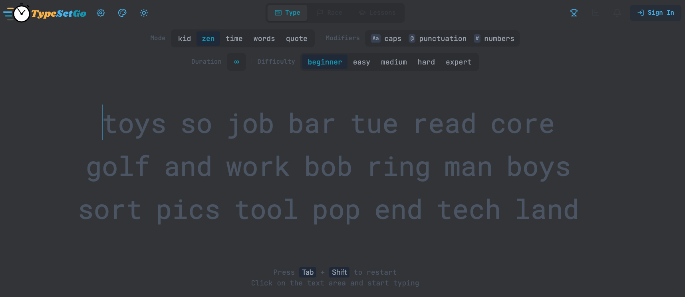
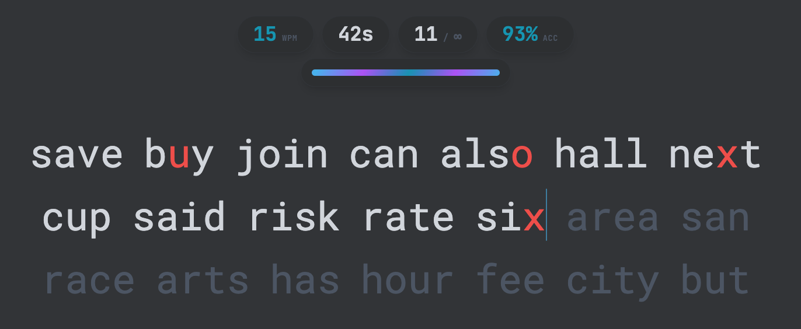
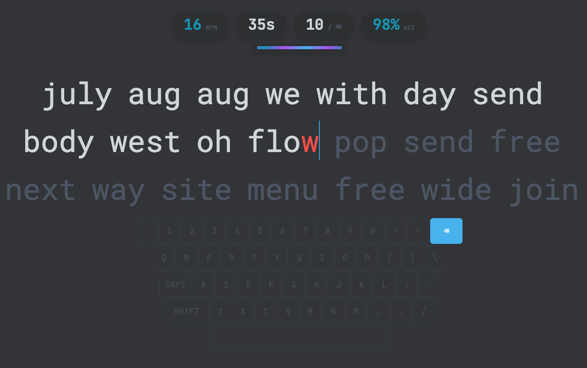
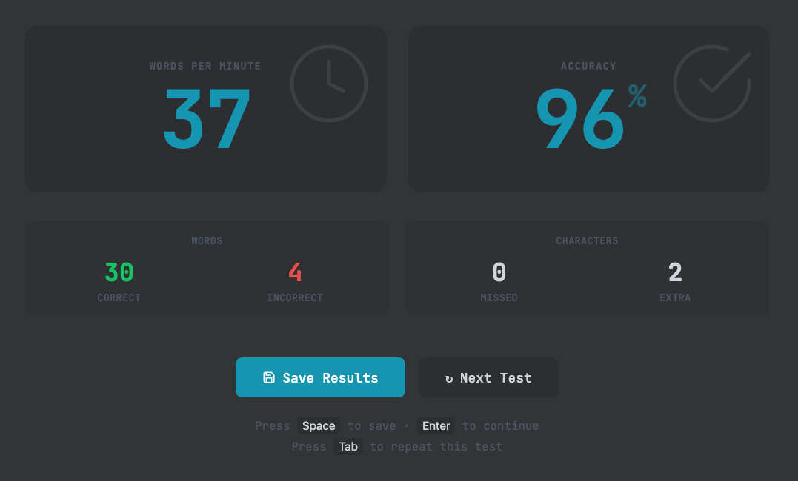
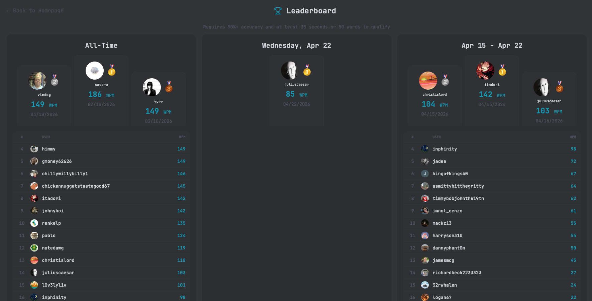

<p align="center">
  <picture>
    <source
      media="(prefers-color-scheme: dark)"
      srcset="public/assets/Banner-Color.png"
    />
    
  </picture>
</p>

<p align="center">
  <a href="https://github.com/dmeim/typesetgo"></a>
  <a href="https://github.com/dmeim/typesetgo"></a>
  <a href="src/"></a>
</p>

A modern, open-source typing practice platform with a clean, distraction-free interface. Multiple test modes, 1300+ themes, sound packs, real-time statistics, and deep customization — all powered by a real-time **Convex** backend with optional **Clerk** authentication.

## Highlights

- **Multiple modes** — Time, Words, Quotes (Short–XL), Zen, Preset, and Custom Text
- **1300+ themes** — Light, dark, and seasonal themes with live preview
- **Ghost Writer** — Race a ghost cursor set to your target WPM
- **Deep statistics** — Real-time WPM, accuracy, raw vs. net speed, consistency charts
- **Sound packs** — Mechanical keyboard sounds (typewriter, creamy, robo, and more)
- **Adaptive difficulty** — Word lists from Beginner to Extreme
- **User accounts** — Track history, streaks, achievements, and leaderboard rankings
- **Self-hostable** — Docker image with nginx for easy deployment

## Screenshots

<table>
  <tr>
    <td width="40%" valign="top">
      <h3>Home</h3>
      <p>The main typing screen with test mode selection (Kid, Zen, Time, Words, Quote), modifier toggles for caps, punctuation, and numbers, adjustable duration or word count, and five difficulty levels from Beginner to Expert.</p>
    </td>
    <td width="60%">
      
    </td>
  </tr>
  <tr>
    <td width="40%" valign="top">
      <h3>Typing Test</h3>
      <p>A distraction-free typing view with live WPM, elapsed time, word count, and accuracy displayed in the stats bar. Correctly typed text turns white while errors are highlighted in red.</p>
    </td>
    <td width="60%">
      
    </td>
  </tr>
  <tr>
    <td width="40%" valign="top">
      <h3>On-Screen Keyboard</h3>
      <p>An optional on-screen keyboard that highlights each key as you type, perfect for younger users learning proper finger placement, but useful for anyone looking to improve their touch typing.</p>
    </td>
    <td width="60%">
      
    </td>
  </tr>
  <tr>
    <td width="40%" valign="top">
      <h3>Results</h3>
      <p>After each test, see your Words Per Minute, accuracy percentage, correct and incorrect word counts, and missed or extra characters. Save your results to track progress or jump straight into the next test.</p>
    </td>
    <td width="60%">
      
    </td>
  </tr>
  <tr>
    <td width="40%" valign="top">
      <h3>Leaderboard</h3>
      <p>A ranked leaderboard showing All-Time, Daily, and Weekly standings. Players who save their results and meet the minimum requirements earn a spot on the board.</p>
    </td>
    <td width="60%">
      
    </td>
  </tr>
</table>

## Quick Start

### Docker

```bash
cd docker
VITE_CONVEX_URL=https://your-project.convex.cloud docker-compose up -d
```

Visit `http://localhost:3000` to start typing.

### Development

**Prerequisites:** [Bun](https://bun.sh) v1.0+ and a [Convex](https://convex.dev) account (free tier available).

```bash
git clone https://github.com/dmeim/typesetgo.git
cd typesetgo
bun install
```

Run two terminals:

```bash
bunx convex dev          # Terminal 1 — backend
bun run dev              # Terminal 2 — frontend (port 3000)
```

| Command | Description |
|---------|-------------|
| `bun run dev` | Start dev server |
| `bun run build` | Production build |
| `bun run test:run` | Run tests |
| `bun run lint` | Run ESLint |
| `bunx convex dev` | Start Convex backend |

## Documentation

- **[Tech Stack](docs/TECH-STACK.md)** — full technology inventory with versions and roles
- **[Docker Deployment](docs/deployment/DOCKER_GUIDE.md)** — container setup and configuration
- **[Core Typing Engine](docs/features/Core_Typing_Engine.md)** — modes, statistics, and architecture
- **[Content Management](docs/features/Content_Management.md)** — word lists, quotes, and adding content
- **[Release Notes](docs/release-notes/)** — changelog and version history
- **[Product Roadmap](docs/TODO.md)** — planned features and progress

*More documentation is planned — theme customization, sound packs, settings reference, keyboard shortcuts, and contributor guides are on the list.*

---

<p align="center">
  <a href="docs/">Docs</a> ·
  <a href="docs/TODO.md">Roadmap</a>
</p>
