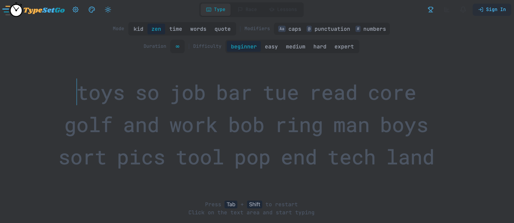
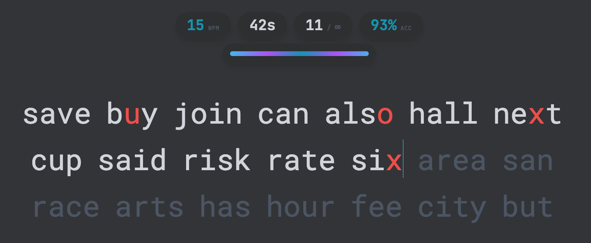
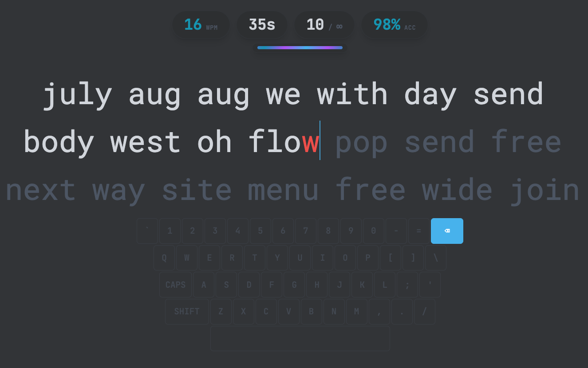
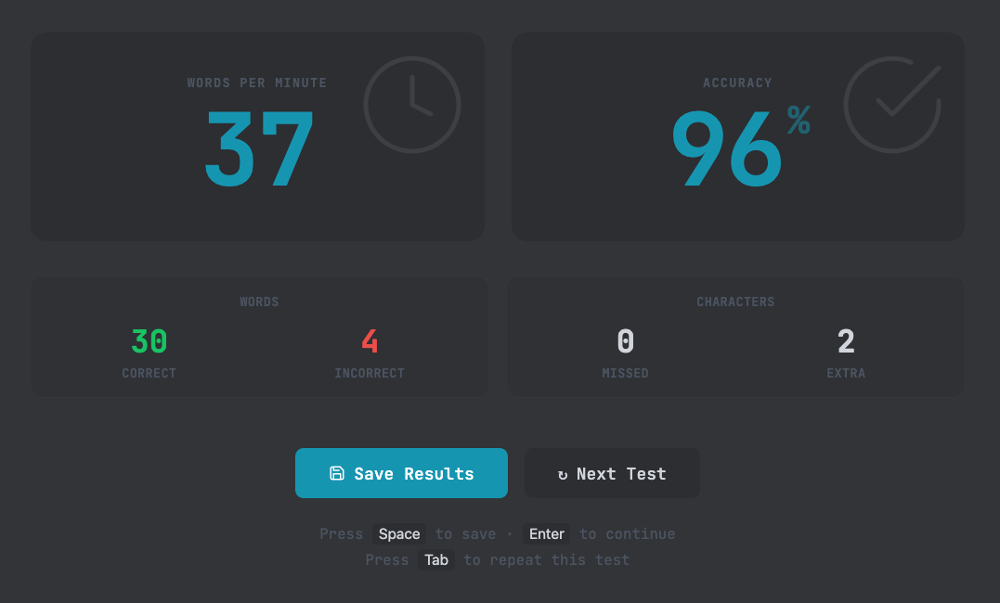
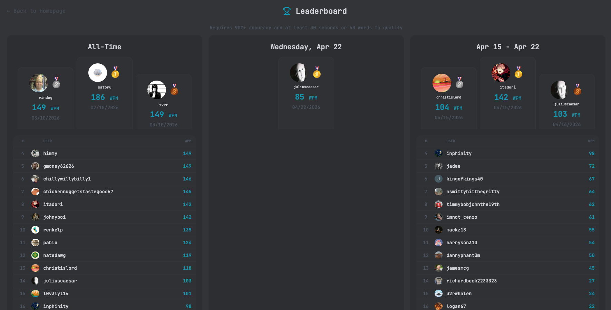

<p align="center">
  <picture>
    <source
      media="(prefers-color-scheme: dark)"
      srcset="public/assets/Banner-Color.png"
    />
    
  </picture>
</p>

<p align="center">
  <a href="https://github.com/dmeim/typesetgo"></a>
  <a href="https://github.com/dmeim/typesetgo"></a>
  <a href="src/"></a>
</p>

A modern, open-source typing practice platform with a clean, distraction-free interface. Multiple test modes, 1300+ themes, sound packs, real-time statistics, and deep customization — all powered by a real-time **Convex** backend with optional **Clerk** authentication.

## Highlights

- **Multiple modes** — Time, Words, Quotes (Short–XL), Zen, and Preset text
- **1300+ themes** — Light, dark, and seasonal themes with live preview
- **Ghost Writer** — Race a ghost cursor set to your target WPM
- **Deep statistics** — Real-time WPM, accuracy, raw vs. net speed, consistency charts
- **Sound packs** — Mechanical keyboard sounds (typewriter, creamy, robo, and more)
- **Adaptive difficulty** — Word lists from Beginner to Expert
- **User accounts** — Track history, streaks, achievements, and leaderboard rankings
- **Cloudflare-hosted** — frontend served by Workers Static Assets, with Clerk and Convex

## Screenshots

<table>
  <tr>
    <td width="40%" valign="top">
      <h3>Home</h3>
      <p>The main typing screen with test mode selection (Zen, Time, Words, Quote, Preset), modifier toggles for caps, punctuation, and numbers, adjustable duration or word count, and five difficulty levels from Beginner to Expert.</p>
    </td>
    <td width="60%">
      
    </td>
  </tr>
  <tr>
    <td width="40%" valign="top">
      <h3>Typing Test</h3>
      <p>A distraction-free typing view with live WPM, elapsed time, word count, and accuracy displayed in the stats bar. Correctly typed text turns white while errors are highlighted in red.</p>
    </td>
    <td width="60%">
      
    </td>
  </tr>
  <tr>
    <td width="40%" valign="top">
      <h3>On-Screen Keyboard</h3>
      <p>An optional on-screen keyboard that highlights each key as you type, perfect for younger users learning proper finger placement, but useful for anyone looking to improve their touch typing.</p>
    </td>
    <td width="60%">
      
    </td>
  </tr>
  <tr>
    <td width="40%" valign="top">
      <h3>Results</h3>
      <p>After each test, see your Words Per Minute, accuracy percentage, correct and incorrect word counts, and missed or extra characters. Save your results to track progress or jump straight into the next test.</p>
    </td>
    <td width="60%">
      
    </td>
  </tr>
  <tr>
    <td width="40%" valign="top">
      <h3>Leaderboard</h3>
      <p>A ranked leaderboard showing All-Time, Daily, and Weekly standings. Players who save their results and meet the minimum requirements earn a spot on the board.</p>
    </td>
    <td width="60%">
      
    </td>
  </tr>
</table>

## Quick Start

### Hosting and deployment

Live app: **https://typesetgo.app**. Cloudflare Workers Static Assets serves the frontend; production Clerk handles sign-in, and the existing Convex **development deployment** holds the app's data.

The deployment record reports an owner-configured Workers Builds connection to GitHub `main`; its first successful automated deployment is not recorded. Remote settings were not rechecked during the September 2026 cleanup. Treat a push to `main` as potentially publishing the frontend. Manual deployment remains available.

For a manual deployment, first verify your Cloudflare account and ignored local build settings:

```bash
bun run build
bun run test:run
bun run cf:deploy
```

`cf:deploy` builds locally and uploads to the live Worker. See the [Cloudflare deployment guide](docs/deployment/CLOUDFLARE_GUIDE.md) for configuration, checks, and migration history. Docker/VPS deployment is retired.

### Development

**Prerequisites:** [Bun](https://bun.sh) v1.3.3+ and a [Convex](https://convex.dev) account (free tier available).

```bash
git clone https://github.com/dmeim/typesetgo.git
cd typesetgo
bun install
```

Start the isolated UI fixture without credentials or a backend:

```bash
bun run dev:fixture      # http://127.0.0.1:4317
```

This uses real UI with local fixture data. For real backend development, follow [development targets](docs/development.md). The existing cloud **development** deployment holds live data; ordinary `convex dev` writes to its selected deployment. `bun run convex:dev` now requires an explicit env file and expected target.

| Command | Description |
|---------|-------------|
| `bun run dev` | Start dev server |
| `bun run build` | Production build |
| `bun run test:run` | Run tests |
| `bun run lint` | Run ESLint with the supported parser API |
| `bun run test:e2e` | Run isolated browser acceptance, using installed Chrome |
| `bun run dev:fixture` | Start isolated UI with local fixture data |
| `bun run convex:dev --env-file PATH --expect local:NAME` | Watch an explicitly selected local backend |

### Browser acceptance without live services

```bash
VITE_CONVEX_URL=https://fixture.invalid VITE_CLERK_PUBLISHABLE_KEY= bun run build
bun run test:e2e                 # Practice, Fonts, Profiles, Host, real Join, Race
bun run test:e2e practice        # One suite during local iteration
bun run test:e2e fonts           # Font loading and built asset paths (requires build)
```

These checks require Node.js 22.12+ and installed Chrome. They run real UI components with local auth/data substitutes; no Clerk or Convex credentials are needed. They cover prompt/session transitions, dialogs and keyboard use, representative layouts/themes, owner/visitor profiles, and multiplayer lifecycle failures/recovery. See the [browser testing guide](tests/browser/README.md) for browser overrides, fixture boundaries, and artifacts.

All downloadable fonts are served locally. See the [font inventory and licenses](public/fonts/README.md) for sources, pinned versions, lazy loading behavior, and update instructions.

Builds retain native TypeScript 7 while lint uses the compatible TypeScript 6 API. Use the package scripts so each tool gets its intended compiler; the [tooling note](docs/ui-cleanup/tooling.md) explains the arrangement.

## Documentation

[Documentation index](docs/README.md) identifies current guides and historical plans. [Codebase review](docs/CODEBASE-REVIEW.md) is the current remediation checklist.

- **[Tech Stack](docs/TECH-STACK.md)** — full technology inventory with versions and roles
- **[Cloudflare Deployment](docs/deployment/CLOUDFLARE_GUIDE.md)** — configured hosting and recorded deployment history
- **[Core Typing Engine](docs/features/Core_Typing_Engine.md)** — modes, statistics, and architecture
- **[Content Management](docs/features/Content_Management.md)** — word lists, quotes, and adding content
- **[Release Notes](docs/release-notes/)** — changelog and version history
- **[Product Roadmap](docs/TODO.md)** — planned features and progress

*More documentation is planned — theme customization, sound packs, settings reference, keyboard shortcuts, and contributor guides are on the list.*

---

<p align="center">
  <a href="docs/">Docs</a> ·
  <a href="docs/TODO.md">Roadmap</a>
</p>
